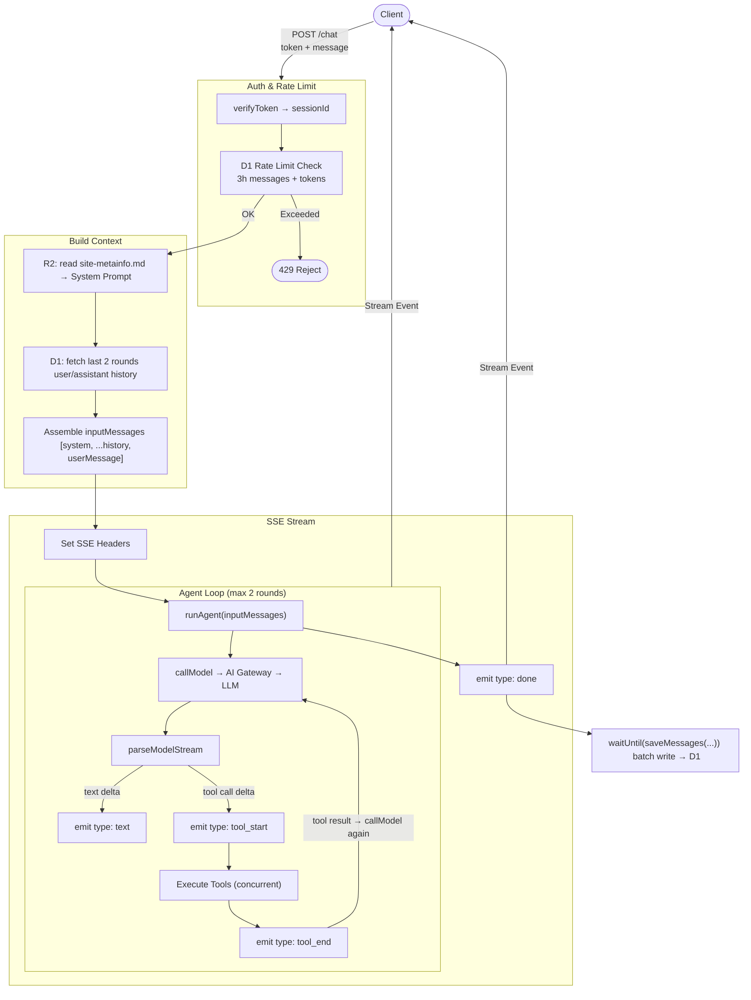

# Surmon.me AI Service 架构文档

[English](./ARCHITECTURE.md)｜[简体中文](./ARCHITECTURE.zh-CN.md)

**surmon.me.ai** 是为 [surmon.me](https://github.com/stars/surmon-china/lists/surmon-me) 生态构建的自包含 AI Agent 服务，基于 Tool-driven 的 Agent 架构，将 CMS 内容（NodePress）、前端网站（Surmon.me）与外部知识源统一接入智能对话能力。

该项目遵循 **高内聚、低耦合** 的设计原则，在保持自身独立演进能力的同时，与生态中的其他系统维持清晰且稳定的协作边界。

本文档旨在帮助开发者理解 **surmon.me.ai** 的设计哲学、技术栈实现与核心数据流。

---


## 技术栈

| 服务                                                                   | 层级 | 职责                                            |
| ---------------------------------------------------------------------- | ---- | ----------------------------------------------- |
| [Zod](https://zod.dev/)                                                | 接口 | 请求参数验证与工具输入类型推导                  |
| [Hono](https://hono.dev/)                                              | 接口 | Workers 上的轻量 Web 框架                       |
| [Cloudflare Workers](https://developers.cloudflare.com/workers/)       | 接口 | 面向 Web 的 API 运行时                          |
| [Cloudflare D1](https://developers.cloudflare.com/d1/)                 | 记忆 | 用户对话历史持久化（SQLite）                    |
| [Cloudflare AI Search](https://developers.cloudflare.com/ai-search/)   | 检索 | 向量数据库，提供 RAG 语义检索能力               |
| [Cloudflare R2](https://developers.cloudflare.com/r2/)                 | 数据 | RAG 知识库原始文件存储（Markdown）              |
| [Cloudflare AI Gateway](https://developers.cloudflare.com/ai-gateway/) | 网关 | LLM 请求代理，提供统一计费、限流、日志          |
| Google Gemini 2.5 Flash                                                | 计算 | 主力语言模型（通过 AI Gateway compat 接口调用） |

## 目录结构

```text
src
├── index.ts           # 应用入口，全局路由分发与错误处理
├── config.ts          # 静态配置常量
├── utils/             # 辅助工具函数
├── database/          # D1 数据表定义 & TypeScript 类型定义
├── webhook/           # 处理来自 NodePress 的 Webhook 事件，将 CMS 内容持久化到 R2
├── chat-admin/        # 为管理员提供的对话查询业务
└── chat-user/         # 用户聊天 Agent 的核心实现
    ├── signature.ts   # Token 签发与验证
    ├── agent/         # Agent 状态机的核心实现
    ├── prompt.ts      # System Prompt 生成
    ├── tools.ts       # Agent 工具定义
    └── database/      # Agent 与 D1 数据库的桥接层
```

## 数据库表结构

```sql
CREATE TABLE chat_messages (
  id            INTEGER  PRIMARY KEY AUTOINCREMENT,
  session_id    TEXT     NOT NULL,        -- 由前端 Token 携带，标识一次会话
  author_name   TEXT,                     -- 可选，前端传入的用户名
  author_email  TEXT,                     -- 可选，前端传入的用户邮箱
  user_id       TEXT,                     -- 可选，前端传入的用户 ID
  role          TEXT     NOT NULL CHECK(role IN ('system','user','assistant','tool')),
  content       TEXT,                     -- 消息文本内容
  model         TEXT,                     -- 使用的模型标识
  tool_calls    TEXT,                     -- JSON 字符串，assistant 调用工具时存储
  tool_call_id  TEXT,                     -- tool 角色消息关联的 tool_calls ID
  input_tokens  INTEGER  NOT NULL DEFAULT 0,
  output_tokens INTEGER  NOT NULL DEFAULT 0,
  created_at    INTEGER  NOT NULL DEFAULT (unixepoch())
);
```

该数据模型服务于：管理员拉取对话记录、用户拉取对话历史、存储模型对话上下文。

设计理念是：与平台解耦、上下文完整、简洁易聚合。本项目参考 OpenAI 的消息结构，抽象出四种对话角色：

- `user`：代表人类发出的提问。
- `assistant`：代表 AI 的回复。
- `tool`：代表工具调用的返回结果。
- `system`：**“造物主的指令”**，通常只在每次对话的第一条出现，对用户不可见。例如 “你是一个代表 surmon.me 的极客助手...” 这类指令，就是以 system 角色发给模型的。

> **为什么数据库要保留 system 字段**：system prompt 通常在代码中动态组装而不持久化。保留该角色是为了支持未来可能增加的审计、A/B 测试等高级场景。

## 核心数据流

### 1. 知识库构建（NodePress → R2）

[Cloudflare AI Search](https://developers.cloudflare.com/ai-search/) 是对多项 Cloudflare 基础能力的整合封装，它可以简洁地将一个数据源接入 RAG 搜索。

AI Search 内部架构为：

1. [数据源](https://developers.cloudflare.com/ai-search/configuration/data-source/)：建立原始数据源。
2. [建立索引](https://developers.cloudflare.com/ai-search/concepts/what-is-rag/)：使用 Embedding 模型向量化 + 向量数据存入 [Vectorize](https://developers.cloudflare.com/vectorize/)。
3. [查询数据](https://developers.cloudflare.com/ai-search/usage/workers-binding/)：由 Workers 通过 `env.AI.aiSearch()` 或 REST API 访问 RAG 服务。

AI Search 支持两种数据源：

- **爬虫（Sitemap/Crawler）**：操作简单，但抓取的是 HTML 且只包含首屏内容，对分段渲染的长文章无能为力。更重要的是，爬虫无法区分正文、侧边栏、评论、AI Review 等 UI 元素，这些噪音会污染 Embedding 的向量空间，导致严重的召回质量问题。
- **R2 存储桶**：直接读取主动维护的 Markdown 文件数据源，内容 100% 可控，可剥离所有 UI 噪音，支持完整长文，并通过 Frontmatter 赋予模型结构化的元数据上下文。

本项目在多维度测试后，使用 **R2 方案**，通过 [NodePress Webhook](https://github.com/surmon-china/nodepress/tree/main/src/modules/webhook) 在内容变更时主动通知 AI Service，AI 服务在验证来源后，实时将数据同步到 R2，AI Search 随后完成增量索引。


### 2. 用户对话（POST /chat）

#### 前端首次访问

1. **用户侧** → `GET /chat/token`
2. **服务侧** → `signToken(randomUUID, secret)`
3. **用户侧** → 将 Token 存入前端 LocalStorage（永不变动）


#### 前端发起对话

1. **用户侧** → `POST /chat`（携带 Token + 用户消息）
2. **服务侧** → 校验 Token `verifyToken` → 解析出 `sessionId`
3. **服务侧** → D1 限流检查（窗口时间内消息数 + Token 用量）
4. **服务侧** → R2 读取 `site-metainfo.md` → 生成 System Prompt
5. **服务侧** → D1 查询最近 2 轮历史消息（仅 user/assistant 纯文本）
6. **服务侧** → 组装 `inputMessages = [systemMessage, ...historyMessages, userMessage]`
7. **服务侧** → 设置 SSE 响应头 → `stream()` 开启流式响应
   - 运行 Agent 状态机：`runAgent(inputMessages)`
   - 初次调用模型：`callModel → AI Gateway compat → Gemini 2.5 Flash`
   - 格式化并将流推至前端：`parseModelStream` 解析 SSE 流
   - 处理文本流：`delta → emit { type: 'text', content }`
   - 处理工具调用：`delta → emit { type: 'tool_start', name }`
     - 并发执行所有工具
     - 调用工具结束：`emit { type: 'tool_end' }`
   - 携带工具结果再次：`callModel`（最多 2 轮）
   - 派发完成事件：`emit { type: 'done' }`
   - 将消息批量写入 D1 数据库：`waitUntil(saveMessages(...))`



### 3. Agent 工具列表

本项目采用了类似 AI SDK [Tools](https://ai-sdk.dev/docs/foundations/tools) 的设计，直接由 Zod 定义 Tool 模型，并最终转换为 LLM 可以理解的 JSON Schema 格式。

| 工具名                  | 触发场景                             | 数据来源                    |
| ----------------------- | ------------------------------------ | --------------------------- |
| `getBlogList`           | 用户询问近期文章                     | NodePress API               |
| `getArticleDetail`      | 获取指定文章全文                     | NodePress API               |
| `getOpenSourceProjects` | 用户询问博主开源项目                 | GitHub raw JSON             |
| `askKnowledgeBase`      | 用户询问博主个人经历、观点、文章内容 | Cloudflare AI Search（RAG） |

### 4. 管理后台（/admin）

- `GET /admin/chat-sessions` → 聚合查询所有会话概览（ChatSession）
- `GET /admin/chat-sessions/:id` → 查询指定会话的完整消息列表

为了使 AI 服务中的鉴权业务简洁易维护，admin 鉴权直接转发 Authorization 头至 NodePress `/admin/verify-token` 进行验证，不在本服务存储管理员凭证。

## 历史消息策略

**给 LLM 的历史（ModelMessage）：**

经过实际测试，RAG 工具返回内容通常 1000-4000 token（具体取决于 AI Search 侧配置的 Chunk Size），带入过多历史消息会导致 token 急剧膨胀，而对上下文连贯性贡献有限。

所以当前实现策略为：只取最近 2 轮（4 条）纯文本 user/assistant 消息，由 SQL 层直接过滤 `tool_calls IS NULL`，排除所有工具调用相关消息。

具体参数可以在 [`CONFIG.CHAT_AGENT_USER_HISTORY_MESSAGES_MAX_ROUNDS`](src/config.ts) 中配置。

**给前端展示的历史（ClientMessage）：**

目前策略为：最多返回最近 50 条 user/assistant 纯文本消息返回给前端用户。

同样过滤 `tool_calls IS NULL`，只展示有文字内容的对话轮次，通过 DESC 排序后 reverse，确保前端按时间正序展示（类似于各大 AI Agent 的效果）。

具体参数可以在 [`CONFIG.CHAT_API_USER_HISTORY_LIST_LIMIT`](src/config.ts) 中配置。

## 安全机制

- **[Webhook 验证](src/webhook/verify.ts)**：HMAC-SHA256 签名 + 5 分钟防重放。
- **[用户 Token](src/chat-user/signature)**：HMAC-SHA256 签发 Token，`sessionId` 作为 payload。
- **[管理员鉴权](src/chat-admin/auth.ts)**：使用 Hono 中间件转发 Token 至 NodePress 验证，不在本服务存储管理员凭证。
- **会话限流**：窗口时间内最多 30 条消息 / 50000 token，可以在 [`CONFIG.CHAT_AGENT_RATE_LIMIT_XXX`](src/config.ts) 中配置。
- **[AI Gateway 限流](https://developers.cloudflare.com/ai-gateway/features/rate-limiting/)**：滑动窗口，10 次请求/分钟。
- **[Prompt 注入防护](src/chat-user/prompt.ts)**：System Prompt 声明安全规则，拒绝角色扮演、规则修改等指令。

## 环境变量（Secrets）

以下通过 `wrangler secret put` 配置，或通过 Cloudflare Workers 后台配置，不出现在代码和配置文件中：

| 变量名              | 用途                                        |
| ------------------- | ------------------------------------------- |
| `CF_ACCOUNT_ID`     | Cloudflare 账户 ID，用于拼接 AI Gateway URL |
| `CF_AIG_TOKEN`      | AI Gateway 鉴权 Token                       |
| `CHAT_TOKEN_SECRET` | 用户 Token 签发密钥                         |
| `WEBHOOK_SECRET`    | Webhook HMAC 签名验证密钥                   |

## 部署与初始化

### 1. 新建 R2 存储桶

在 Cloudflare 后台创建 R2 Bucket，命名后在 `wrangler.json` 中绑定。

### 2. 新建 D1 数据库并初始化表结构

```bash
npx wrangler d1 execute <database_name> --remote --file=./src/database/schema.sql
```

### 3. 新建 AI Search 实例

在 Cloudflare 后台创建 AI Search 实例，并连接之前创建的 R2 存储桶。

将创建后的 AI Search 实例名称绑定在 `wrangler.json` 中的 `AI_SEARCH_INSTANCE_NAME` 字段。

推荐配置：

- 嵌入模型：`@cf/qwen/qwen3-embedding-0.6b`
- 区块大小：1024 tokens
- 区块重叠：15%
- 重排序模型：`@cf/baai/bge-reranker-base`

### 4. 配置 AI Gateway

在 Cloudflare 后台创建 AI Gateway，命名与 `wrangler.json` 中 `AI_GATEWAY_NAME` 一致。

推荐配置：

- 速率限制：滑动窗口，10 次/分钟
- 酌情开启 Guardrails 内容审核（开启后会增加总成本）

### 5. 配置 Secrets

```bash
wrangler secret put CF_ACCOUNT_ID
wrangler secret put CF_AIG_TOKEN
wrangler secret put CHAT_TOKEN_SECRET
wrangler secret put WEBHOOK_SECRET
```

### 6. 本地开发

```bash
pnpm run dev
```

如需连接 remote 资源（D1/R2）且网络受限，使用代理启动：

```bash
HTTPS_PROXY=http://127.0.0.1:6152 pnpm run dev
```

### 7. 部署

```bash
pnpm run deploy
```
